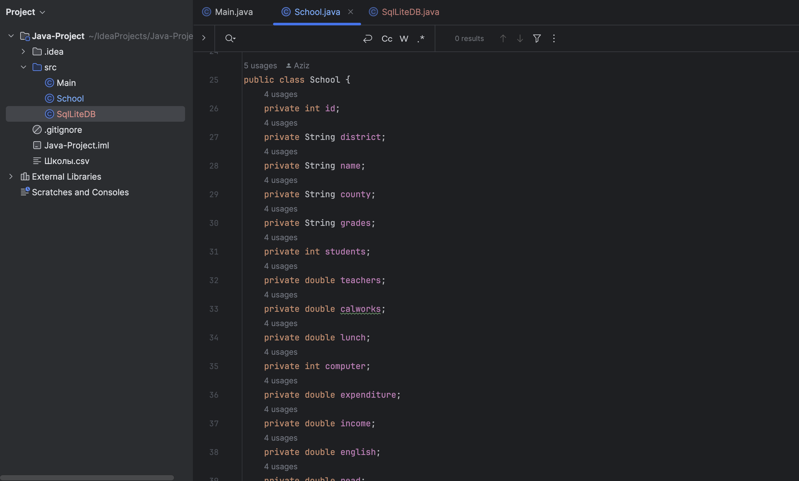
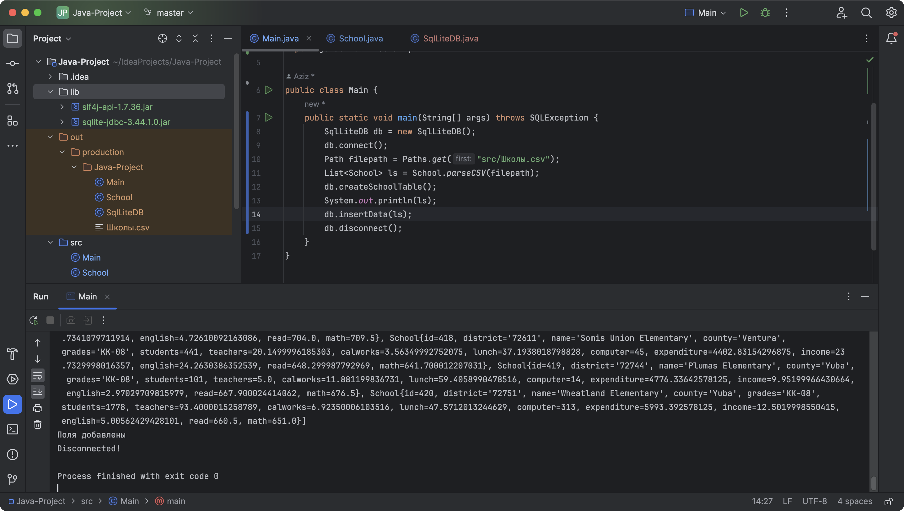
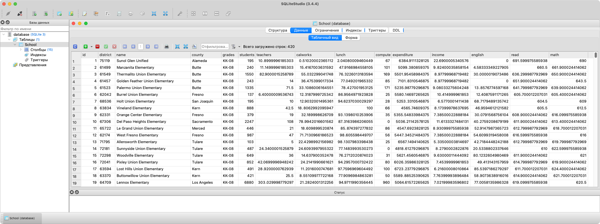
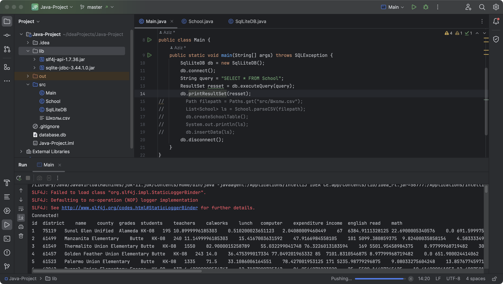
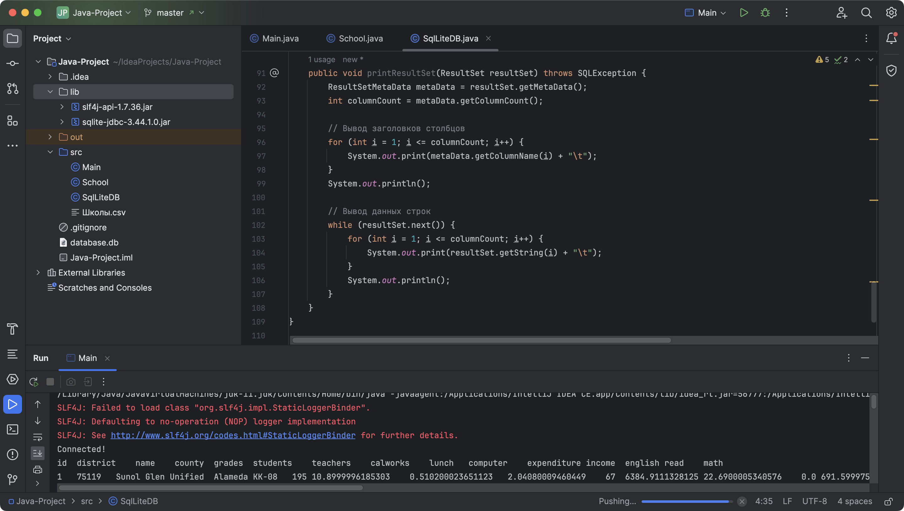
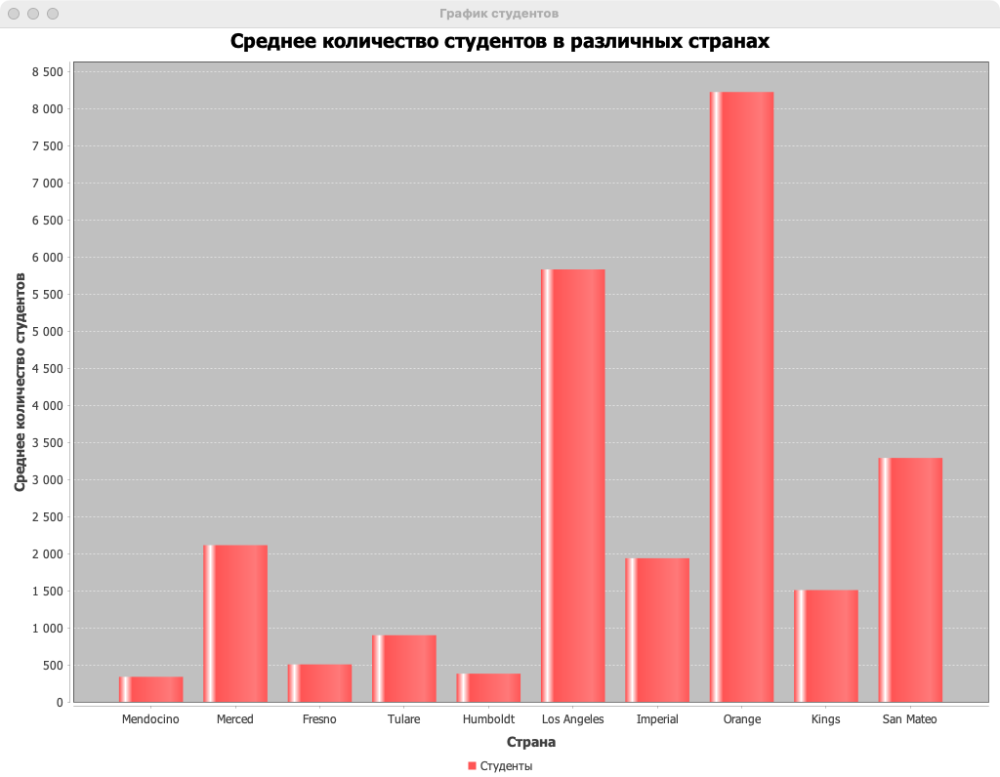
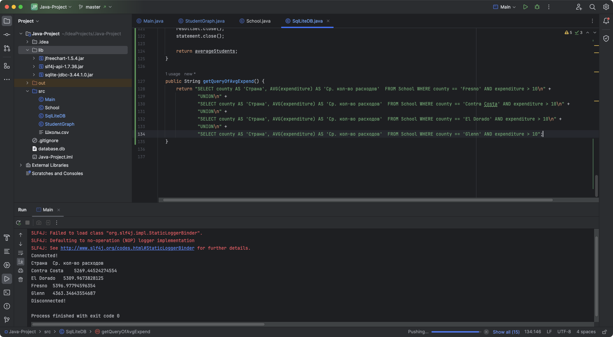
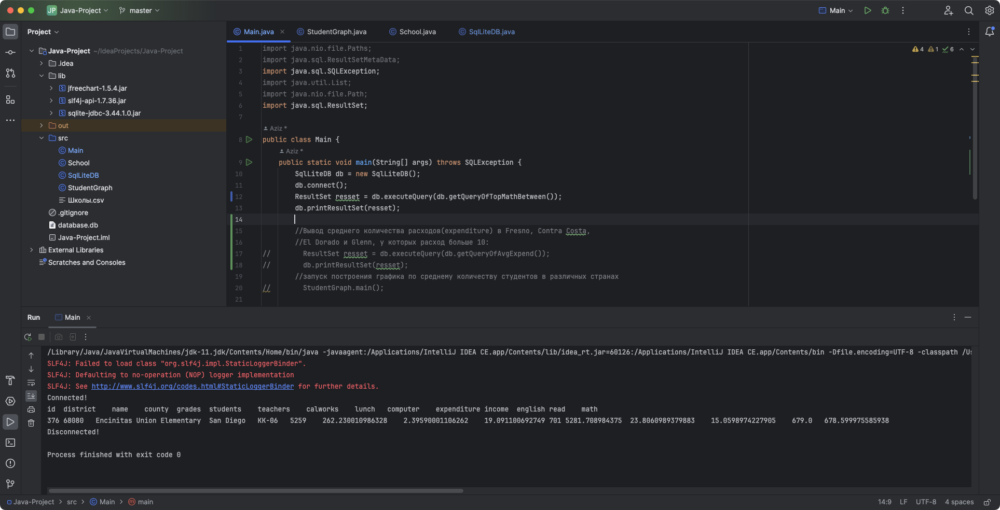
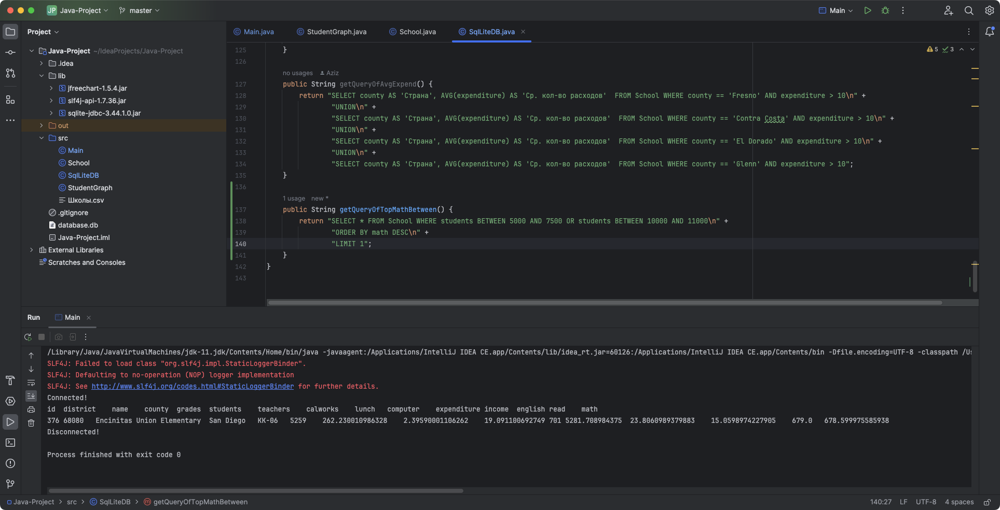
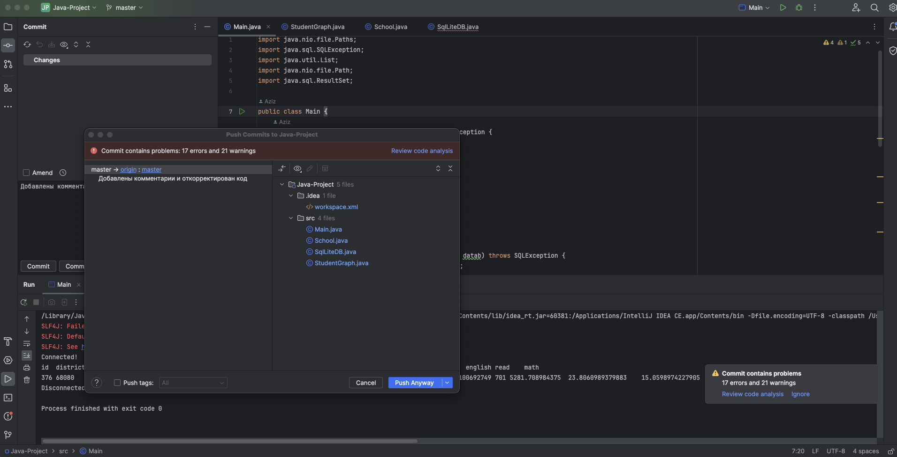

# Проект по Java. 2 Вариант
## Название таблицы
### Школы
### Ход работы:
1. Создание класса School, в котором описывается каждое значение объекта. 
2. Встроил в этот класс метод парсинга csv файла.

3. Создал класс SqlLiteDB, в котором описал всю работу с базой данных.
4. Протестировал создание бд и таблицы в ней.

5. Парсинг csv файла и ввод значений в базу данных работают корректно.

6. Создал и протестировал метод вывода результата SQL запроса.

## Задача 1
Постройте график по среднему количеству студентов, в 10 различных странах, взять на свой выбор.
### Ход работы:
1. Создал метод для получения среднего количества студентов конкретной страны.
2. Создал класс StudentGraph, в котором описал работу вывода графика с помощью библиотеки jfreechart.

## Задача 2
Выведите в консоль среднее количество расходов(expenditure) в Fresno, Contra Costa, El Dorado и Glenn, у которых расход больше 10.
### Ход работы:
1. Создаю запрос для получения среднего расхода в странах, указанных в задании. Поместил метод в класс SqlLiteDB.

2. Использовал ранее созданный метод для вывода результата sql.

## Задача 3
Выведите в консоль учебное заведение, с количеством студентов равному от 5000 до 7500 и с 10000 до 11000, с самым высоким показателем по математике (math)
### Ход работы:
1. Создаю запрос для получения строки заведения с самым высоким показателем по математике и количеством студентов равному от 5000 до 7500 или с 10000 до 11000. Поместил метод в класс SqlLiteDB.

2. Для вывода использовал ранее созданный метод для вывода результата sql.

### Выполнение коммитов

